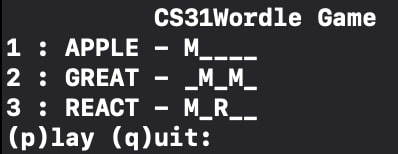
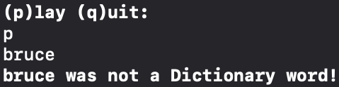

# Wordle-CS31
Wordle is a popular word game found at: [Wordle - The New York Times][1].  

This is the final project of CS31-22summer.  

A five-letter word is chosen randomly each play.   

Enter p to start a guess. After every guess, each letter is marked as either 'R', 'M' or '\_': 'R' indicates that letter is correct and in the correct position, 'M' means it is in the answer but not in the right position, while '\_' indicates it is not in the answer at all.

Players have up to eight tries. After eight failures, the winning world will be displayed.

Only dictionary words are allowed.

[1]: https://www.nytimes.com/games/wordle/index.html
